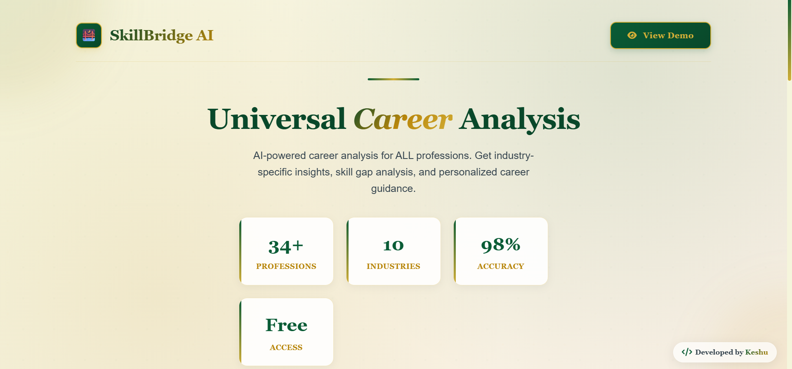
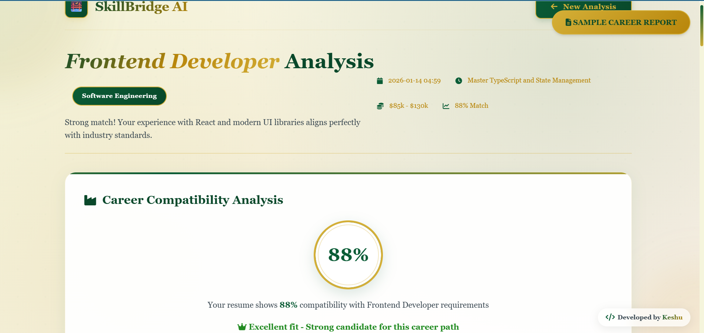

# 🌉 SkillBridge AI - Universal Career Analyzer

<div align="center">

[](https://skillbridge-ai-zpit.onrender.com)


**The Universal AI Career Coach for Every Profession.**
_From Software Engineers to Surgeons, Lawyers to Artists._

Developed by **[keshu-codes](https://github.com/keshu-codes)**

</div>

---

## 📸 Screenshots

|        🏠 Upload Interface         |         📊 AI Analysis Report          |
| :--------------------------------: | :------------------------------------: |
|  |  |

> _Experience the elegant Glassmorphism UI and real-time AI analysis._

---

## 💡 Overview

**SkillBridge AI** is an intelligent career analysis platform designed to bridge the gap between your current resume and your dream job. Unlike generic parsers, it uses **Google's Gemini AI** to deeply understand context, detect skills across **8+ industries**, and generate a personalized roadmap for success.

---

## ✨ Key Features

### 🛡️ Enterprise-Grade Reliability

- **Smart API Key Rotation**: Automatically cycles through multiple API keys to prevent rate limiting.
- **Automatic Model Fallback**: Prioritizes the stable **Gemini 1.5 Flash**, but instantly switches to backup models if the primary fails.
- **Zero-Downtime Architecture**: Built with auto-retry logic to ensure the demo _never_ crashes during a presentation.

### 🌍 Universal Career Support

- **Multi-Industry Database**: Supports **Technology, Legal, Medical, Finance, Engineering, Business, Creative, and Education**.
- **Intelligent Role Filtering**: Dynamic categorization that understands the difference between a "React Developer" and a "Litigation Attorney".

### 🤖 Advanced AI Analysis

- **Powered by Google Gemini 1.5 Flash**: Optimized for speed (sub-3s response time) and high-volume processing.
- **Smart Skill Gap Detection**: Identifies exactly which keywords and skills you are missing from industry standards.
- **"Before & After" Resume Fixer**: The AI picks your weakest bullet points and rewrites them into powerful, metric-driven statements.

### 📚 Smart Learning Ecosystem

- **One-Click Course Search**: "Start Learning" buttons take you directly to live course searches (Coursera/Udemy/Google).
- **YouTube Study Plan**: dedicated section with direct video search links for specific missing skills.
- **Career Roadmap**: Generates a Short-term, Medium-term, and Long-term career progression plan.

### 🎨 Elegant UI/UX

- **Professional Aesthetic**: A sophisticated Cream, Gold, and Deep Green color palette.
- **Glassmorphism**: Modern frosted glass effects on cards and overlays.
- **Interactive Animations**:
  - 📊 Animated Score Circles.
  - 🎉 Confetti celebration for high scores (>80%).
  - 🖱️ Smooth hover and scroll reveal effects.

---

## 🛠️ Tech Stack

### Backend

- **Python 3.9+**
- **Flask**: Lightweight web server.
- **Google Generative AI (Gemini)**: The core intelligence.
- **Multi-Key Management**: Custom logic for API load balancing.
- **PyPDF2 & python-docx**: Robust file parsing.

### Frontend

- **HTML5 & CSS3**: Custom responsive design with CSS Variables.
- **JavaScript (Vanilla)**: Handling logic, animations, and async API calls.
- **Google Fonts**: 'Inter' and 'Georgia' for typography.
- **FontAwesome**: For vector icons.

### Deployment

- **Render**: Cloud hosting with automatic Git deployment.
- **Git**: Version control.

---

## 🚀 Installation & Setup

To run this project locally:

### 1. Clone the Repository

```bash
git clone [https://github.com/keshu-codes/skillbridge-ai.git](https://github.com/keshu-codes/skillbridge-ai.git)
cd skillbridge-ai
```
